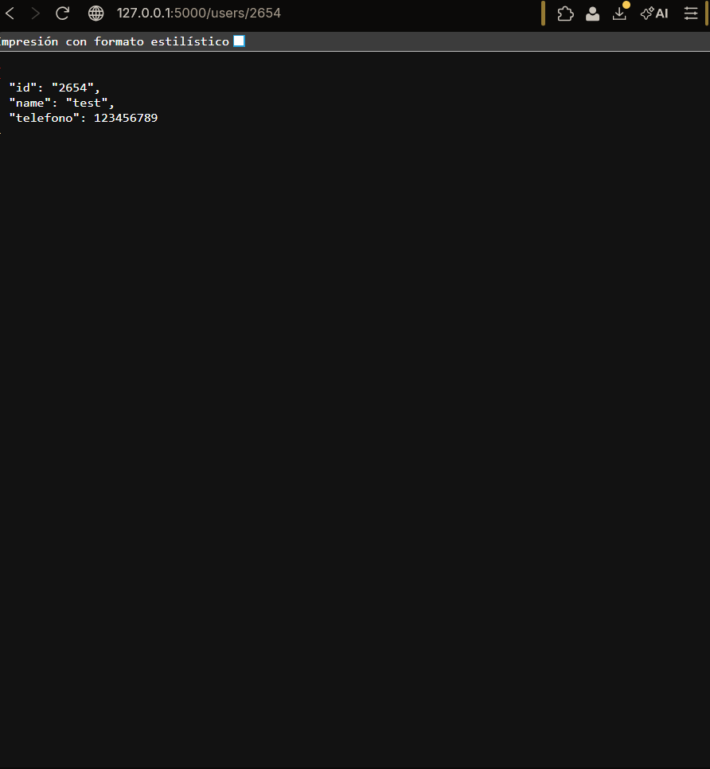

---

# API de Usuarios con Flask (Y66-API)

Esta es una API RESTful básica construida con **Python** y el micro-framework **Flask**. El proyecto permite gestionar información de usuarios y sirve como base para integraciones futuras con Spotify y Supabase.

## Requisitos e Instalación

1. **Clonar el repositorio:**
```bash
git clone https://github.com/MrSilence0/ImplementacionAPI.git
cd Y66-API

```


2. **Crear y activar el entorno virtual:**
```bash
python -m venv venv
# En Windows:
.\venv\Scripts\Activate.ps1

```


3. **Instalar dependencias:**
```bash
pip install flask

```


---

## Endpoints y Métodos

La API utiliza los métodos estándar de HTTP para la manipulación de datos:

| Método | Endpoint | Descripción |
| --- | --- | --- |
| **GET** | `/users/<user_id>` | Obtiene los detalles de un usuario específico. |
| **POST** | `/users` | Crea un nuevo usuario enviando un JSON. |
| **PUT** | `/users/<user_id>` | Actualiza la información de un usuario existente. |
| **DELETE** | `/users/<user_id>` | Elimina un usuario del sistema. |

---

### Ejemplo: Método GET

Este método se utiliza para **consultar** información. Puedes pasar un parámetro opcional llamado `query` en la URL.

**Prueba en el navegador o Postman:** `http://127.0.0.1:5000/users/66?query=hola`



---

### Ejemplo: Método POST

Se utiliza para **enviar** datos al servidor (crear recursos). Es necesario enviar el cuerpo de la petición en formato JSON y configurar el `Content-Type: application/json`.

**URL:** `http://127.0.0.1:5000/users`
**Body (JSON):**

```json
{
    "id": "20",
    "name": "JAVIER",
    "telefono": "999-888-777"
}

```


---

### Otros Métodos (Ejemplos de implementación)

A continuación, se muestra cómo lucirían los métodos **PUT** y **DELETE** en el código:

```python
# Ejemplo de actualización (PUT)
@app.route('/users/<user_id>', methods=['PUT'])
def update_user(user_id):
    data = request.get_json()
    return jsonify({"status": "updated", "id": user_id, "new_data": data}), 200

# Ejemplo de eliminación (DELETE)
@app.route('/users/<user_id>', methods=['DELETE'])
def delete_user(user_id):
    return jsonify({"status": "deleted", "id": user_id}), 200

```

---

